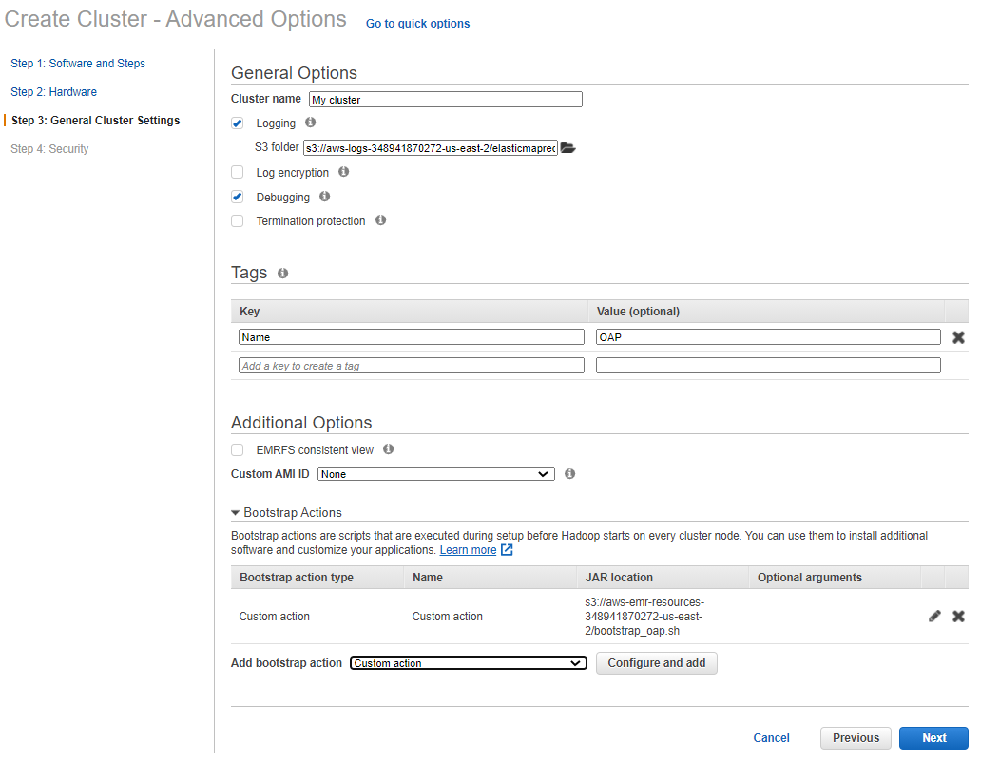

# Use OAP on Amazon EMR cloud

## 1. Upload init script 

Upload the init script **[bootstrap_oap.sh](./bootstrap_oap.sh)** to S3:
    
1. Download **[bootstrap_oap.sh](./bootstrap_oap.sh)** to a local folder.
2. Update **[bootstrap_oap.sh](./bootstrap_oap.sh)** to S3.


## 2. Create a new cluster using bootstrap script
To create a new cluster using the uploaded bootstrap script, follow the following steps:

1. Click the  **Go to advanced options** to custom your cluster;
2. **Software and Steps:** choose the release of emr and the software you need;
3. **Hardware:** choose the instance type and other configurations of hardware;
4. **General Cluster Settings:** add bootstrap action and add **[bootstrap_oap.sh](./bootstrap_oap.sh)** like following picture;

5. **Security:** define the permissions and other security configurations;
6. Click **Create cluster**. 


## 3. Run benchmark easily by using **[run_benchmark.sh](./benchmark/run_benchmark.sh)**

The script supports to run TPC-DS, TPC-H and HiBench easily. Before you use **[run_benchmark.sh](./benchmark/run_benchmark.sh)**, you should add **[install_benchmark.sh](./benchmark/install_benchmark.sh)** script for bootstrap action when creating a cluster.(Note: you can refer to the step to add **[bootstrap_oap.sh](./bootstrap_oap.sh)**.)  


If you want to run benchmark by using [OAP](https://github.com/Intel-bigdata/OAP), you should follow the [OAP user guild](https://github.com/Intel-bigdata/OAP/blob/master/docs/OAP-Installation-Guide.md) to configure "/etc/spark/conf/spark-defaults.conf" when running TPC-DS and TPC-H or configure "/opt/software/HiBench/conf/spark.conf" when running HiBench.  

### 1. Run HiBench
You need to follow the [Hibench Guide](https://github.com/Intel-bigdata/HiBench) to config /opt/software/HiBench/conf/spark.conf and /opt/software/HiBench/conf/hadoop.conf. This is the example to run K-means by using Intel-MLlib:

To edit /opt/software/HiBench/conf/spark.conf:
```
hibench.spark.home                /lib/spark
hibench.spark.master              yarn
spark.files                       /opt/software/oap/oap_jars/oap-mllib-1.1.0.jar
spark.executor.extraClassPath     ./oap-mllib-1.1.0.jar
spark.driver.extraClassPath       /opt/software/oap/oap_jars/oap-mllib-1.1.0.jar
hibench.yarn.executor.num         2
hibench.yarn.executor.cores       4
spark.executor.memory             2g
spark.executor.memoryOverhead     1g
spark.driver.memory               1g
```
To edit /opt/software/HiBench/conf/hadoop.conf:
```
hibench.hadoop.home               /lib/hadoop/
```
To generate data or run workload:
```  
Generate data: ./run_benchmark.sh -g|--gen   -w|--workload hibench -W|--hibenchWorkload [ml/kmeans|micro/terasort|..] -P|--hibenchProfile [tiny|small|large|huge|gigantic|bigdata] --Port [8020|customed hdfs port]  
Run benchmark: ./run_benchmark.sh -r|--rerun -w|--workload hibench -W|--hibenchWorkload [ml/kmeans|micro/terasort|..] -P|--hibenchProfile [tiny|small|large|huge|gigantic|bigdata] --Port [8020|customed hdfs port]
```

###2. Run TPC-DS:  
```
Generate data: ./run_benchmark.sh -g|--gen   -w|--workload tpcds -f|--format [parquet|orc] -s|--scaleFactor [10|custom the data scale,the unit is GB] -d|--doubleForDecimal -p|--partitionTables --Port [8020|customed hdfs port]   
Run benchmark: ./run_benchmark.sh -r|--rerun -w|--workload tpcds -f|--format [parquet|orc|arrow] -i|--iteration [1|custom the interation you want to run] -f|--format [parquet|orc] -s|--scaleFactor [10|custom the data scale,the unit is GB] --Port [8020|customed hdfs port]   
```
###3. Run TPC-H:  
```
Generate data: ./run_benchmark.sh -g|--gen   -w|--workload tpcds -f|--format [parquet|orc] -s|--scaleFactor [10|custom the data scale,the unit is GB] -d|--doubleForDecimal -p|--partitionTables --Port [8020|customed hdfs port]  
Run benchmark: ./run_benchmark.sh -r|--rerun -w|--workload tpch  -f|--format [parquet|orc|arrow] -i|--iteration [1|custom the interation you want to run] -f|--format [parquet|orc] -s|--scaleFactor [10|custom the data scale,the unit is GB] --Port [8020|customed hdfs port] 
``` 
(Note: OAP is installed at "/opt/software/oap"; only enabling native-sql-engine can run TPC-DS or TPC-H with arrow format.)